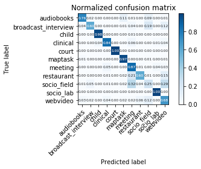

## (Extra) results

Most of our results and analysis can be found in the [paper](https://arxiv.org/abs/1910.10655) directly.
Since we couldn't give all of the details in a 4-long pages paper, we'll enjoy this free space to give you as many details as possible.

#### Performances on the domain classification task

We can look at the performances that the branch in charge of classifying domains gets : 

In particular, we see that the uncertainty we get for the **socio_field** domain is high : it gets confused a lot with the **meeting** and **webvideo** domain.
One might hope to improve the performances on the voice activity detection task by reducing the confusion we get on the domain classification task.

#### All-domains experiments

Here, we train, develop and test our model on the 11 domains of DIHARD.
The **Relative improvement** column is computed against the VAD that has NOT been trained in the domain adversarial fashion.

|Alpha|Dev Error|Test Error|Relative improvement|
| ------------- |-------------|-------------|-------------|
|0|9,098|10,15|None|None|
|0,001|9,014|10,09|-0,6%|
|0,01|8,945|10,06|-0,9%|
|0,1|9,852|9,95|-2,0%|
|1|10,074|10,06|-0,9%|
|10|9,998|10,05|-1,0%|

#### Per-domain experiments

Here, we train, develop and test our model on one single domain.
These results can be interpreted as a "measure of complexity" of the domain of interest : Higher is the detection error rate, harder it is for the model to explain the domain.
One thing that one might want to look at is the performance discrepancy between the development error and the test error, this gap can be interpreted as a measure of "How different are the development set and the test set".

|Domain|Dev Error|Test Error|
| ------------- |-------------|-------------|
|AB|2,06|2,61|
|BI|3,95|5,3|
|CL|27,44|40,31|
|CI|9,27|8,46|
|CR|3,18|3,34|
|MT|4,06|4,63|
|ME|5,41|19,02|
|RE|6,07|12,17|
|SF|6,54|11,42|
|SL|6,13|5,38|
|WV|15,44|20,36|

In particular, we see that the **child language** and the **webvideos** domains are the domains for which we get the highest detection error rate (and the ones that correspond to the most spontaneous speech !)

#### Leave-one-out experiments

Then, we can have a look at the leave-one-out experiments in which we train and develop the model on 10 out of 11 domains of DIHARD, and test it on the remaining domain.

The column "**Rel. Imp to classic VAD**" corresponds to the relative improvement compared to the VAD that has not been trained in an adversarial fashion.

The column "**Rel. Imp to per-domain VAD**" corresponds to the relative improvement compared to the VAD trained on the target domain in a fully supervised manner.

Test set|Alpha|Development error|Test error|Rel. Imp. to classic VAD |Rel. Imp to per-domain VAD
| ------------- | ------------- | ------------- | ------------- | ------------- | ------------- 
|AB|0|9,566|3,62| ||38,70%
| |0,001|9,736|3,08|-14,92%|18,01%
| |0,01|9,974|3,29|-9,12%|26,05%
| |0,1|9,698|3,2|-11,60%|22,61%
| |1|10,814|2,75|-24,03%|5,36%
| |10|10,967|2,85|-21,27%|9,20%
|BI|0|9,477|4,5| ||-15,09%
| |0,001|9,333|4,72|4,89%|-10,94%
| |0,01|9,934|4,59|2,00%|-13,40%
| |0,1|9,389|4,64|3,11%|-12,45%
| |1|10,667|4,74|5,33%|-10,57%
| |10|10,855|4,61|2,44%|-13,02%
|CL|0|7,443|39,45| ||-2,13%
| |0,001|8,863|43,85|11,15%|8,78%
| |0,01|7,753|35,06|-11,13%|-13,02%
| |0,1|7,552|35,89|-9,02%|-10,97%
| |1|8,548|35,23|-10,70%|-12,60%
| |10|8,622|38,03|-3,60%|-5,66%
|CI|0|8,783|24,8| ||193,14%
| |0,001|8,814|22,94|-7,50%|171,16%
| |0,01|8,843|21,89|-11,73%|158,75%
| |0,1|9,35|22,87|-7,78%|170,33%
| |1|9,709|21,34|-13,95%|152,25%
| |10|9,414|20,09|-18,99%|137,47%
|CR|0|9,443|13,74| ||311,38%
| |0,001|9,685|11,85|-13,76%|254,79%
| |0,01|9,509|10,77|-21,62%|222,46%
| |0,1|9,642|13,14|-4,37%|293,41%
| |1|10,542|3,87|-71,83%|15,87%
| |10|11,837|4,16|-69,72%|24,55%
|MT|0|9,551|5,37| ||15,98%
| |0,001|9,633|5,32|-0,93%|14,90%
| |0,01|9,742|5,73|6,70%|23,76%
| |0,1|9,734|5,61|4,47%|21,17%
| |1|10,697|5,64|5,03%|21,81%
| |10|10,934|6,88|28,12%|48,60%
|ME|0|8,646|8,91| ||-53,15%
| |0,001|8,73|9,13|2,47%|-52,00%
| |0,01|8,651|8,51|-4,38%|-55,26%
| |0,1|8,653|8,48|-5,05%|-55,42%
| |1|8,995|8,16|-8,84%|-57,10%
| |10|9,357|8,08|-10,17%|-57,52%
|RE|0|9,137|14,29| ||17,42%
| |0,001|9,073|14,84|3,85%|21,94%
| |0,01|9,164|14,07|-1,54%|15,61%
| |0,1|9,483|14,99|4,90%|23,17%
| |1|10,148|13,15|-7,98%|8,05%
| |10|10,482|13,03|-8,82%|7,07%
|SF|0|8,977|10,79| ||-5,52%
| |0,001|9,743|10,77|-0,19%|-5,69%
| |0,01|9,022|12,8|18,63%|12,08%
| |0,1|8,97|10,68|-1,02%|-6,48%
| |1|9,683|9,03|-16,31%|-20,93%
| |10|10,117|9,91|-8,16%|-13,22%
|SL|0|9,434|15,29| ||184,20%
| |0,001|9,457|14,28|-6,61%|165,43%
| |0,01|9,105|13,41|-12,30%|149,26%
| |0,1|10,513|11,18|-26,88%|107,81%
| |1|10,029|17,86|16,81%|231,97%
| |10|10,582|13,21|-13,60%|145,54%
|WV|0|8,2|16,99| ||-16,55%
| |0,001|7,901|18,16|6,89%|-10,81%
| |0,01|8,145|17,66|3,94%|-13,26%
| |0,1|8,133|17,41|2,47%|-14,49%
| |1|8,735|17,52|3,12%|-13,95%
| |10|9,183|17,08|0,53%|-16,11%

We obtain very different behaviors depending on the domain of interest.
For instance : 
- For the **audiobooks** domain, the domain adversarial approach outperforms by a great margin the classic VAD. In that case, adversarially training our model on the domain classification task helped us to improve our performance on this target domain.
However, performances are not better than a VAD trained in a supervised manner on the target domain.

    &rarr; **If we didn't have any labels for this domain, adversarially train the model would be a good way to improve the performances**

- We have the opposite behavior for the **broadcast interviews** domain for which the adversarially trained VAD performs worst than the classic VAD. 
However, in this case, performances obtained by the adversarially trained model are better than a model that would have been trained only on this target domain. 
    
    &rarr; **Adding more data to the training set, even though they come from a different distribution, seems a viable strategy for improving the performances.**
